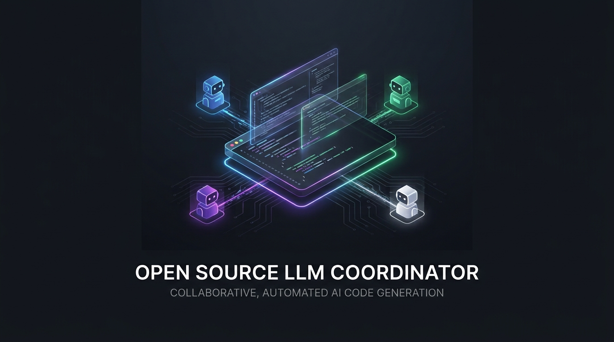
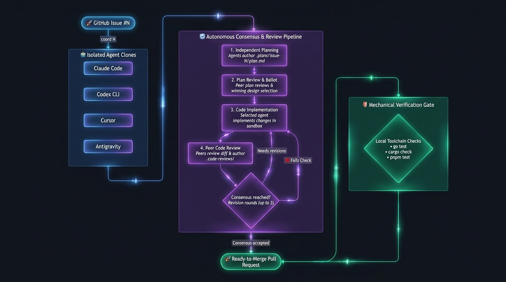

<p align="center">
  
</p>

# coord

> Multi-agent consensus engine and workflow driver for autonomous software development.


[](LICENSE)

Instead of trusting a single AI model with your codebase, `coord` coordinates a team of diverse coding agents across isolated Git clones to plan, review, implement, and ballot on a GitHub issue, mechanically verifies the exact pushed commits against your project's toolchain, and opens a pull request for the owner.

---

## How it works

<p align="center">
  
</p>

`coord` orchestrates a structured, multi-agent consensus lifecycle:

1. **Issue snapshot & readiness:** `coord N` snapshots issue N from the GitHub repository configured as the product origin, binds that snapshot and the workspace configuration into the automation digest, and starts the issue state machine.
2. **Independent planning:** Each active agent explores the codebase and publishes `.plans/issue-N/plan.md` on its own `issue-N/<agent>` branch.
3. **Plan review & ballot:** Agents review peer plans (`.plans/issue-N/review.md`) and submit private response ballots. The highest-voted plan is selected.
4. **Implementation:** Active agents implement the selected plan in separate sibling clones (all active agents implement under `consensus`; one designated agent under `reviewed`).
5. **Peer code review & revisions:** Peer agents inspect diffs, publish `.code-reviews/`, vote on implementations, and run up to three revision rounds to resolve findings.
6. **Mechanical verification gate:** The driver materializes a clean detached worktree at the cleanup pin and runs every configured toolchain check (`go test`, `cargo check`, `pnpm test`). Any check failure blocks PR publication.
7. **Pull request:** After clean verification, the coordinator pushes `issue-N/<agent>-final` and opens a PR. Under default PR policy (`coord-open-unmerged`), the PR is left as a draft for owner review; `coord-merged` marks it ready and merges it.

Profiles include `solo` (single agent), `reviewed` (team reviews plans, designated agent implements), and `consensus` (full team implements and peer-reviews diffs). See [Profiles](docs/coord-driver.md#profiles).

---

## Why coord

- **Two-tier peer review:** Agents review high-level design plans *and* concrete code diffs before any code is finalized, catching architectural flaws early.
- **Multi-agent consensus:** Claude, Codex, Cursor, and Antigravity challenge and ballot each other's work to reduce single-model blind spots.
- **Repository isolation:** Onboarding leaves your product's working tree byte-for-byte untouched. Agents work in private sibling clones, and runtime state lives in an external directory.
- **Mechanical toolchain verification:** Passes your project's native tests and linters on a clean worktree before PR creation; completion claims are strictly backed by verified commit evidence.
- **Owner control plane:** Full interactive supervision with live status, manual pause/resume, advisory steering (`/steer`), hold recovery, and automatic cleanup.

---

## Requirements

- **Node 26** and **pnpm 11** to run the coordinator driver (independent of your product's toolchain)
- **Git** for bootstrap and repository operations
- **GitHub CLI (`gh`)**, authenticated for product issue and PR operations
- **tmux** for interactive agent launch and delivery
- One or more installed agent harnesses (**Claude Code**, **Codex CLI**, **Cursor**, or **Antigravity**)
- The product's declared development tools (for example Go, Cargo, Node, or Python)

---

## Quick start

### 1. Install

```sh
curl -fsSL https://raw.githubusercontent.com/gwhizoftv/coordination/main/scripts/bootstrap.sh | sh
```

Bootstrap installs coordination under `~/.local/share/coordination` and links `~/.local/bin/coord` (add `~/.local/bin` to `PATH` if prompted). To inspect the script before running, see [Bootstrap once](docs/setup-workspace.md#bootstrap-once).

### 2. Onboard

```sh
coord onboard /path/to/my-repo
```

Onboard automatically detects Go, Rust, Node, and Make project configurations, sets up sibling agent clones, and runs `coord doctor`. By default, it configures all four harnesses with the `consensus` profile. For a lighter setup with a single harness:

```sh
coord onboard /path/to/my-repo --agents codex --profile solo
```

### 3. Run

```sh
cd /path/to/my-repo
gh issue create --title "Feature or fix description" --body "Acceptance criteria..."
coord 42
```

Replace `42` with your issue number. `coord 42` launches the configured agents in tmux, drives the consensus loop, runs toolchain checks, and opens the PR.

### Owner-driven manual mode

For direct tasks in agent chats without creating a GitHub issue, run:

```sh
cd /path/to/my-repo
coord manual

# Later, close only this product's manual session:
coord detach manual
```

See [Owner-driven manual lifecycle](docs/coord-driver.md#owner-driven-manual-lifecycle).

---

## Product languages

| Language / Ecosystem | Detection Marker | Verification Policy |
|---|---|---|
| **Go** | `go.mod` | Auto-detected (`go test ./...`, `go vet ./...`) |
| **Rust** | `Cargo.toml` | Auto-detected (`cargo test`, `cargo check`) |
| **Node.js** | `package.json` (`pnpm`, `yarn`, `npm`) | Auto-detected from package scripts |
| **Make** | `Makefile` | Auto-detected recognized targets (`test`, `check`) |
| **Python** | `pyproject.toml`, `requirements.txt` | Configured via `--declare` |

Any language works when its verification commands can be run as argument arrays and its tools are installed on the host machine. See [Product languages](docs/setup-workspace.md#product-languages) for details and custom declarations.

---

## Platforms

macOS includes native Terminal.app window management. Linux and other UNIX platforms run via tmux without Terminal.app integration. Native Windows operation is not currently supported.

---

## Documentation

- 📖 [Operator & Driver Guide](docs/coord-driver.md) — Profiles, owner interactive controls, holds, recovery, and runtime topology.
- 🛠️ [Workspace Setup Guide](docs/setup-workspace.md) — Onboarding, workspace layout, multi-product configurations, and custom verification policies.
- 📋 [Readiness Policy](docs/readiness-policy.md) — Agent protocol and participation evidence rules.
- 📊 [Analytics & Telemetry](docs/analytics.md) — Efficiency reporting and turn telemetry.
- 🗺️ [Repository Map](docs/repo-map.md) — Internal architecture overview and module breakdown.
- 🤝 [Contributing Guidelines](CONTRIBUTING.md) — Human contribution workflow, branch conventions, and testing.
- 🔒 [Security Policy](SECURITY.md) — Private vulnerability reporting.

---

## Development

To develop or contribute to `coord`:

```sh
nvm use 26
pnpm install --frozen-lockfile
pnpm check:fast   # Lint, typecheck, and fast tests
pnpm check        # Full acceptance: build, fast tests, and e2e suite
./coord --help
```

---

## License

MIT — see [LICENSE](LICENSE). Coordination is distributed as open-source software via GitHub.
